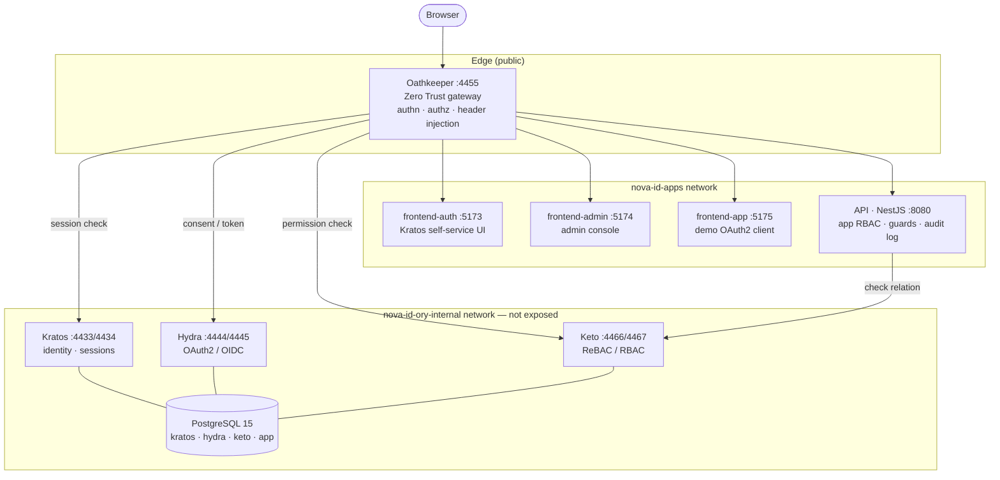

# Nova ID

[](https://opensource.org/licenses/MIT)
[](https://www.docker.com/)
[](docs/ARCHITECTURE.md#zero-trust-model)
[](https://www.ory.sh/)

Production-**grade** identity & access management infrastructure built on the **Ory Stack** (Kratos, Hydra, Keto, Oathkeeper) with Vue 3 frontends. **Zero Trust** by design: every request goes through Oathkeeper; the internal identity services are never exposed.

> **Scope, honestly.** The security layer — Ory Stack, the Oathkeeper Zero Trust gateway, and a dual RBAC model — is production-grade and fully wired. The NestJS API is a **demo surface** that exercises the auth, guards, and authorization end-to-end; it is not a real business domain. Nova ID exists to demonstrate IAM *architecture*, not to ship a product.

---

## What it demonstrates

For anyone evaluating this as an engineering sample:

- **Zero Trust topology** — two isolated Docker networks; Ory services (Kratos/Hydra/Keto) and PostgreSQL live on an internal network with **no host ports**. Oathkeeper is the only component bridging the public edge and the internal stack.
- **Gateway-enforced auth** — 15 declarative Oathkeeper access rules handle authentication (Kratos session check), authorization (Keto permission check), and **identity propagation** (signed `id_token` JWT + `X-User-*` headers injected upstream). The API trusts headers, never the network.
- **Dual RBAC model** — a *platform* role lives in the Kratos identity (`platform_admin` / `platform_user`); an *application* role lives in the API's own store (`app_admin` / `app_user`). Separating who-you-are-on-the-platform from what-you-can-do-in-an-app is a deliberate design choice.
- **Full self-service identity** — login, registration, recovery, email verification, settings, TOTP, and the OAuth2 consent screen, all implemented against Kratos via `@ory/client`.
- **Security rigor** — see [`docs/SECURITY_CODE_REVIEW.md`](docs/SECURITY_CODE_REVIEW.md) for a detailed self-audit of the threat surface.

---

## Architecture



- **Kratos** — identity, registration, login, sessions (30-day TTL), recovery, verification, TOTP
- **Hydra** — OAuth2 / OIDC issuer (JWT access tokens, refresh, ID token)
- **Keto** — relationship-based access control; namespaces `system`, `users`, `admin`, `nova`, `ranks`
- **Oathkeeper** — the gateway: authentication, authorization, and `X-User-*` / `id_token` injection

**[Architecture guide](docs/ARCHITECTURE.md)** — diagrams, request flows, Zero Trust model.

### Request flow: an authenticated call

```
Browser ──▶ Oathkeeper:4455
              │  validate Kratos session (whoami)
              │  inject X-User-ID / X-User-Email / X-User-Role + signed id_token
              ▼
            API (NestJS)
              AuthenticatedGuard trusts the injected headers — never the network
              RoleGuard / AppAdminGuard enforce platform + app roles
```

---

## Quick start

```bash
git clone https://github.com/cativo23/nova-id.git
cd nova-id
docker compose up -d
# wait ~60s for migrations + Ory services, then:
./scripts/setup-all-permissions.sh
```

| App      | URL                     |
|----------|-------------------------|
| Auth UI  | http://localhost:5173   |
| Admin    | http://localhost:5174   |
| Test app | http://localhost:5175   |
| API      | http://localhost:4455   |

**📖 [Getting Started](docs/GETTING_STARTED.md)** — installation, first login, permissions.

---

## Tech stack

| Layer       | Tech                                                                 |
|-------------|----------------------------------------------------------------------|
| Identity    | Ory Kratos, Hydra, Keto, Oathkeeper (v25.4.0)                         |
| API         | NestJS 10 · TypeScript 5.3 · Node 20 · TypeORM                        |
| Frontends   | Vue 3.4 · Vite 5 · Vue Router 4 · Tailwind CSS · `@ory/client`       |
| Data        | PostgreSQL 15 (Ory + app)                                            |
| Infra       | Docker Compose · Traefik (production) · Mailpit (local SMTP)          |

---

## Documentation

| Guide | Description |
|-------|-------------|
| [**Getting Started**](docs/GETTING_STARTED.md) | Install, verify, first login |
| [**Architecture**](docs/ARCHITECTURE.md) | System design, Ory Stack, Zero Trust |
| [**Auth & RBAC**](docs/AUTH_AND_RBAC.md) | Roles, Keto namespaces, permissions |
| [**Security review**](docs/SECURITY_CODE_REVIEW.md) | Threat-surface self-audit |
| [**Operations**](docs/OPERATIONS.md) | Run, test, troubleshoot |
| [**Domains**](README-DOMAINS.md) | Local + production domain / Traefik setup |
| [**Docs index**](docs/README.md) | Full doc list |

---

## License

MIT — see [LICENSE](LICENSE).
