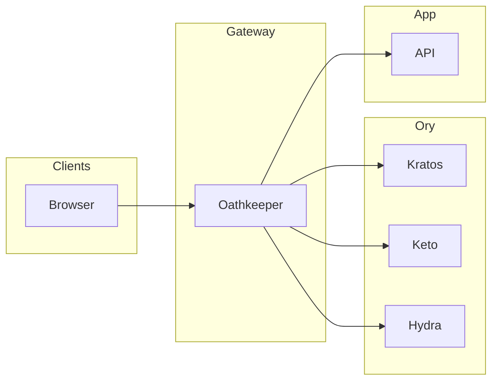

# Nova ID

[](https://opensource.org/licenses/MIT)
[](https://www.docker.com/)
[](docs/ARCHITECTURE.md#zero-trust-model)
[](https://www.ory.sh/)

Production-ready identity and access management built on the **Ory Stack** (Kratos, Hydra, Keto, Oathkeeper) with Vue 3 frontends. **Zero Trust** architecture: all access via Oathkeeper; no direct access to internal services.

---

## Quick start

```bash
git clone https://github.com/cativo23/nova-id.git
cd nova-id
docker compose up -d
# Wait ~60s, then:
./scripts/setup-all-permissions.sh
```

| App      | URL                     |
|----------|-------------------------|
| Auth UI  | http://localhost:5173   |
| Admin    | http://localhost:5174   |
| Test app | http://localhost:5175   |
| API      | http://localhost:4455   |

**📖 [Getting Started](docs/GETTING_STARTED.md)** — Installation, first login, permissions.

---

## Architecture



- **Kratos** — Identity, registration, login, sessions  
- **Keto** — RBAC, permissions (`platform_admin` / `platform_user`)  
- **Hydra** — OAuth2 / OIDC  
- **Oathkeeper** — Gateway: auth, authz, header injection  

**[Architecture guide](docs/ARCHITECTURE.md)** — Diagrams, request flows, Zero Trust.

---

## Documentation

| Guide | Description |
|-------|-------------|
| [**Getting Started**](docs/GETTING_STARTED.md) | Install, verify, first login |
| [**Architecture**](docs/ARCHITECTURE.md) | System design, Ory Stack, Zero Trust |
| [**Auth & RBAC**](docs/AUTH_AND_RBAC.md) | Roles, Keto namespaces, permissions |
| [**Operations**](docs/OPERATIONS.md) | Run, test, troubleshoot |
| [**Docs index**](docs/README.md) | Full doc list |

---

## Features

- **Zero Trust** — All traffic via Oathkeeper; internal services not exposed  
- **Platform RBAC** — `platform_admin` (admin UI, user management) and `platform_user` (app access)  
- **Sessions & OAuth2** — Web sessions (Kratos) and tokens (Hydra)  
- **Vue 3 frontends** — Auth UI, Admin dashboard, test app  

---

## License

MIT — see [LICENSE](LICENSE).
