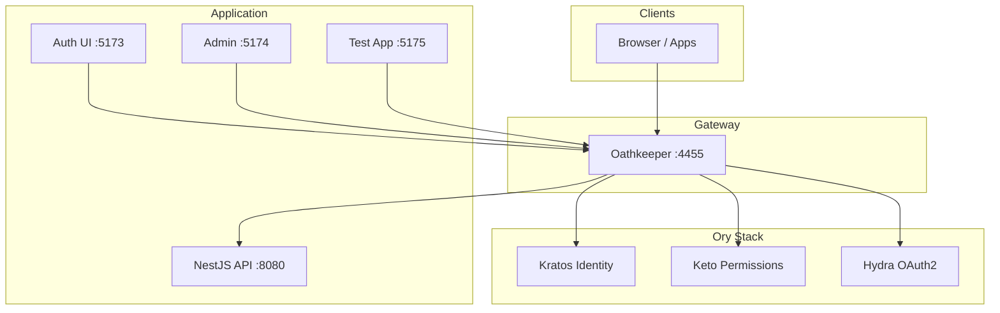
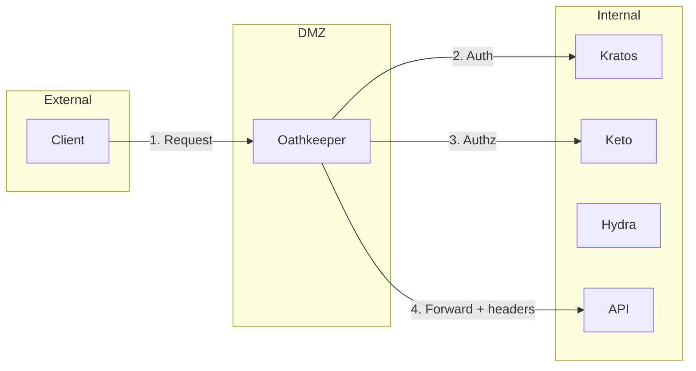
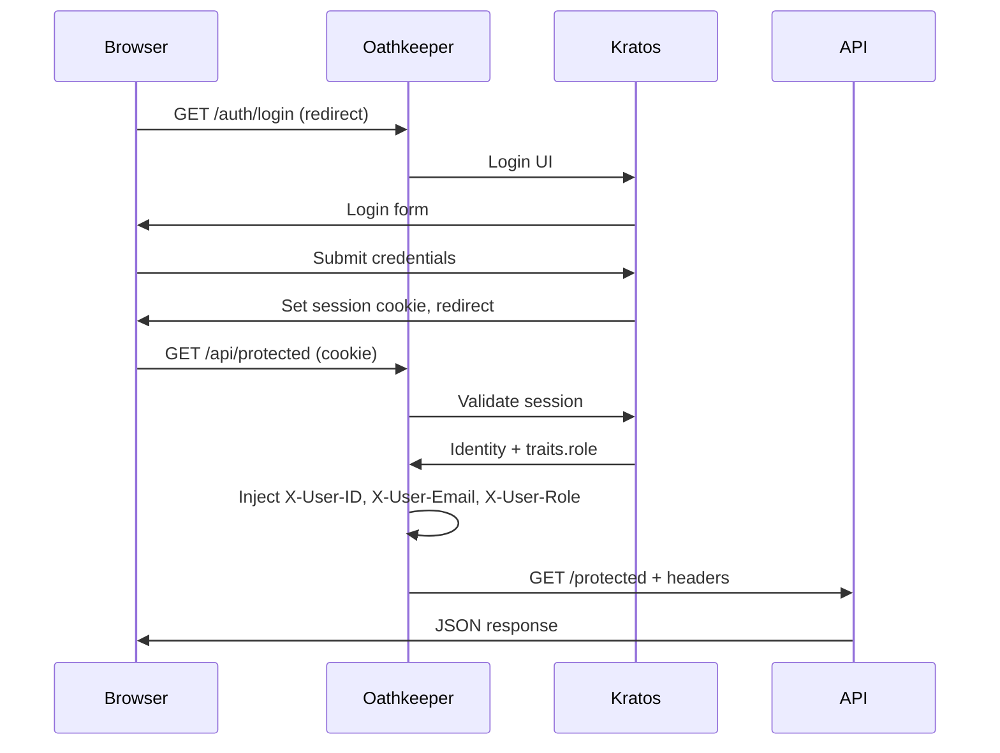
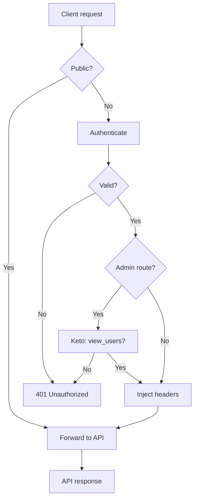
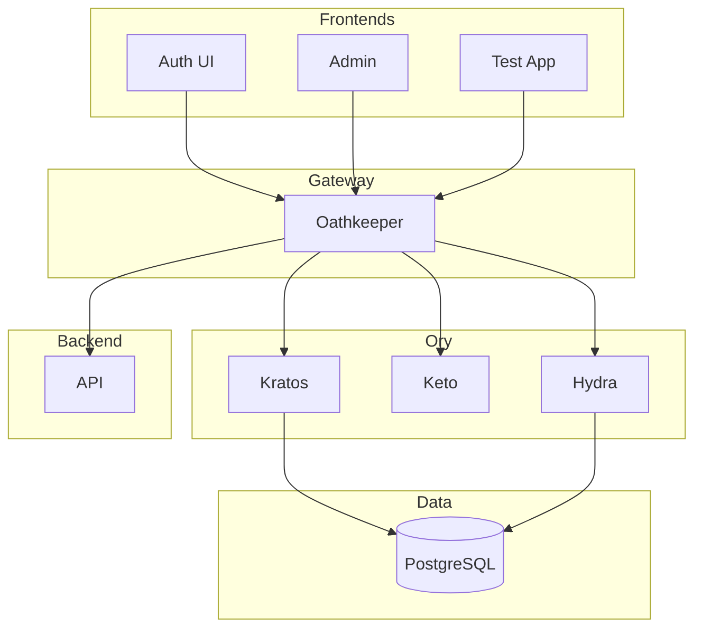

# Nova ID Architecture

This document describes the system design, the Ory Stack components, and the Zero Trust security model.

---

## System overview

All external traffic goes through **Oathkeeper**. Kratos, Keto, Hydra, and the API are not exposed directly to clients in the default Zero Trust setup.

---

## The Ory Stack

Nova ID uses four Ory components:

| Component   | Role            | Ports (admin) | Purpose                                        |
|------------|------------------|---------------|------------------------------------------------|
| **Kratos** | Identity         | 4433 / 4434   | Users, registration, login, sessions, passwords |
| **Keto**   | Authorization    | 4466 / 4467   | RBAC, permissions, role membership              |
| **Hydra**  | OAuth2 / OIDC    | 4444 / 4445   | Tokens for mobile, third‑party, APIs            |
| **Oathkeeper** | API gateway | 4455 / 4456   | Auth, authz, routing, header injection          |

### Kratos — Identity

- Registration, login, logout
- Password reset, email verification
- Session management
- Identity traits (e.g. `email`, `full_name`, `role`)

User data is stored in PostgreSQL. Sessions are validated via cookies; Oathkeeper uses Kratos to validate them before forwarding requests.

### Keto — Permissions

- Role-based access (RBAC)
- Relation tuples: e.g. `ranks:platform_admin#member@user:&lt;id&gt;`
- Permissions granted to roles; users are assigned to roles
- Real-time checks; no permission caching

See [Auth & RBAC](AUTH_AND_RBAC.md#keto-namespaces) for namespaces and examples.

### Hydra — OAuth2 / OIDC

- OAuth2 flows (authorization code, client credentials, etc.)
- OpenID Connect
- Token issuance and introspection

Used for mobile apps, SPAs, and third‑party integrations. Web session-based flows typically use Kratos + Oathkeeper only.

### Oathkeeper — Gateway

- **Authenticate**: validate session (Kratos) or Bearer token (Hydra)
- **Authorize**: optional Keto checks (e.g. `/admin/**` → `view_users`)
- **Mutate**: inject `X-User-ID`, `X-User-Email`, `X-User-Role` (from Kratos traits)
- **Route**: forward to API or frontends

Access rules live in `config/oathkeeper/access-rules.yml`.

---

## Zero Trust model

**Principle:** *Never trust, always verify.*

- Internal services (Kratos, Keto, Hydra, API) are not exposed to the internet.
- All access is through Oathkeeper. It authenticates and authorizes every request.
- The API does not call Kratos/Keto/Hydra directly; it trusts Oathkeeper-injected headers (or validated JWTs) and optional Keto checks done at the gateway.

### Implications

1. **Session-based (web):** Browser → Oathkeeper → Kratos validates session → Oathkeeper injects `X-User-*` → API.
2. **Token-based (mobile/API):** Client → Oathkeeper with Bearer token → Hydra introspects → Oathkeeper forwards → API.
3. **Admin routes:** `/admin/**` requires `view_users`; Oathkeeper checks Keto before allowing access.

---

## Request flows

### Web login and API call (session)

### Protected API with role

1. Request hits Oathkeeper (e.g. `/api/admin-demo`).
2. Oathkeeper validates session with Kratos.
3. For `/admin/**`, Oathkeeper checks Keto (e.g. `view_users`).
4. Oathkeeper injects `X-User-ID`, `X-User-Email`, `X-User-Role` and forwards to API.
5. API uses `RoleGuard` to enforce `platform_admin` when required.

### Public API

Routes like `/api/health` and `/api/public` match a public rule: no authentication, optional `noop` mutator, then forward to API.

---

## Data flow summary

---

## Component diagram

---

## Next steps

- [Auth & RBAC](AUTH_AND_RBAC.md) — Authentication, roles, and Keto namespaces  
- [Operations](OPERATIONS.md) — Running, testing, and troubleshooting  
- [API README](../api/README.md) — API endpoints and integration
