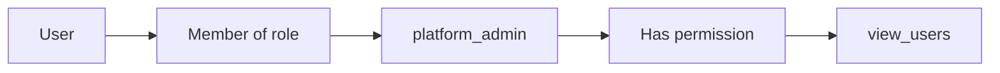

# Authentication & RBAC

This document explains how authentication and authorization work in Nova ID, and how Keto namespaces and roles are used.

---

## Authentication vs authorization

| | Authentication | Authorization |
|---|----------------|----------------|
| **Question** | *Who are you?* | *What can you do?* |
| **Mechanism** | Login, sessions, tokens | Roles, permissions, Keto checks |
| **Example** | Email + password → Kratos session | `platform_admin` → access admin UI |

Nova ID uses **Kratos** for authentication (identity, sessions, passwords) and **Keto** for authorization (permissions, RBAC).

---

## Authentication methods

### Session-based (web)

1. User signs in via Auth UI → Kratos creates a session.
2. Browser stores a session cookie.
3. Requests to Oathkeeper include the cookie.
4. Oathkeeper validates the session with Kratos, then injects `X-User-ID`, `X-User-Email`, `X-User-Role` and forwards to the API.

**Used by:** Auth UI, Admin dashboard, Test app.

### Token-based (OAuth2 / OIDC)

1. Client obtains an access token from **Hydra** (e.g. authorization code or client credentials).
2. Client sends `Authorization: Bearer <token>` to Oathkeeper.
3. Oathkeeper introspects the token with Hydra, then forwards to the API.

**Used by:** Mobile apps, third‑party integrations, SPAs using OAuth2.

---

## Platform roles

Nova ID uses two **platform roles**:

| Role | Purpose |
|------|--------|
| **platform_admin** | Admin dashboard, user management, permission management, access to admin-only API routes. |
| **platform_user** | Normal users; app access only. No admin UI or admin-only APIs. |

Roles are stored:

- In **Kratos** as `traits.role` on the identity.
- In **Keto** as membership in the `ranks` namespace (e.g. `ranks:platform_admin#member@user:&lt;id&gt;`).

Oathkeeper sends the role to the API via `X-User-Role`. The API can also enforce role with `RoleGuard` (e.g. `RequireRole('platform_admin')`).

---

## Keto namespaces

Permissions are organized in **namespaces**. RBAC uses **subject sets**: permissions are granted to **roles**, and **users** are assigned to roles. Keto resolves “user → role → permission” when checking.



### Namespaces

| Namespace | Purpose |
|-----------|--------|
| **ranks** | Role membership. Stores `platform_admin` / `platform_user`. Example: `ranks:platform_admin#member@user:123`. |
| **users** | User management permissions (`view_users`, `add_users`, `edit_users`, `delete_users`, `change_permissions`). |
| **system** | System-wide admin (e.g. `manage_permissions`). |
| **admin** | Admin panel access (`access`). |
| **nova** | Application-specific permissions (e.g. `nova:analytics#access`). |

### RBAC pattern

1. **Grant permission to a role** (e.g. `view_users` to `platform_admin`):
   - Relation tuple: `users:management#view_users` ↔ subject set `ranks:platform_admin#member`.
2. **Assign user to role**:
   - Relation tuple: `ranks:platform_admin#member@user:&lt;id&gt;`.
3. **Check permission**: You ask Keto “can `user:123` do `view_users` on `users:management`?”. Keto resolves role membership and returns allowed/denied.

### Example: grant `view_users` to `platform_admin`

```bash
curl -X PUT http://localhost:4467/admin/relation-tuples \
  -H "Content-Type: application/json" \
  -d '{
    "namespace": "users",
    "object": "management",
    "relation": "view_users",
    "subject_set": {
      "namespace": "ranks",
      "object": "platform_admin",
      "relation": "member"
    }
  }'
```

### Example: assign user to `platform_admin`

```bash
curl -X PUT http://localhost:4467/admin/relation-tuples \
  -H "Content-Type: application/json" \
  -d '{
    "namespace": "ranks",
    "object": "platform_admin",
    "relation": "member",
    "subject_id": "user:USER_ID"
  }'
```

Use `USER_ID` from Kratos (identity ID).

---

## Role–permission mapping

### platform_admin

- **users**: `view_users`, `add_users`, `edit_users`, `delete_users`, `change_permissions`
- **system**: `manage_permissions`
- **admin**: `access` (admin panel)

### platform_user

- No admin permissions. App access only; per-app roles are handled in each application’s backend.

---

## Setup and role syncing

### Initial setup

```bash
./scripts/setup-all-permissions.sh
```

This:

1. Grants the user-management and admin permissions to `platform_admin`.
2. Assigns existing Kratos users to roles based on `traits.role`.

### Assigning platform_admin to a user

```bash
./scripts/assign-platform-admin-to-user.sh user@example.com
```

Updates Kratos `traits.role` and Keto role membership for that user.

### Role syncing (UI)

When an admin changes a user’s role in **Users Management**:

1. Kratos `traits.role` is updated.
2. Keto membership is updated (remove old role, add new role) via `syncRolePermissions()` in `useAuth.js`.

---

## Checking permissions

Frontends use `usePermissions` (and related composables) to call Keto through Oathkeeper. Checks are done in real time (no permission caching).

**Example flow:**

```
Check: users:management#view_users@user:123
  → Keto: user:123 member of ranks:platform_admin? Yes
  → Keto: platform_admin has view_users? Yes
  → Result: Allowed
```

---

## Next steps

- [Architecture](ARCHITECTURE.md) — System design and request flows  
- [Operations](OPERATIONS.md) — Running services and troubleshooting  
- [Create users](../CREATE_USER_INSTRUCTIONS.md) — Create users and assign roles
