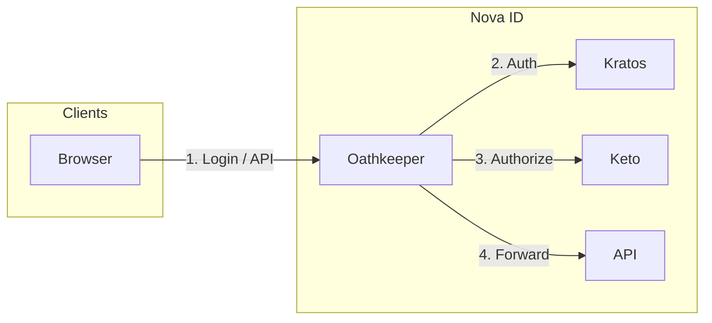

# Getting Started with Nova ID

This guide gets you from zero to a running Nova ID system with a verified login in about 15 minutes.

---

## What is Nova ID?

**Nova ID** is an identity and access management (IAM) system built on the [Ory Stack](https://www.ory.sh/). It provides:

- **User management** — Registration, login, password reset, sessions
- **Role-based access** — Two platform roles: `platform_admin` and `platform_user`
- **Zero Trust security** — All access via Oathkeeper; no direct access to internal services
- **Multiple frontends** — Auth UI, Admin dashboard, and a test application



---

## Prerequisites

- **Docker** and **Docker Compose**
- **Git**
- **4GB+ RAM** recommended

Check versions:

```bash
docker --version    # 20.10+
docker compose version
git --version
```

---

## 1. Clone and start services

```bash
git clone https://github.com/cativo23/nova-id.git
cd nova-id
```

Generate environment (if needed):

```bash
./scripts/generate-env.sh
```

Start all services:

```bash
docker compose up -d
```

Wait 30–60 seconds for services to become ready.

---

## 2. Verify installation

```bash
# Service status
docker compose ps

# Health checks
curl -s http://localhost:4434/health/ready | jq .   # Kratos Admin
curl -s http://localhost:4466/health/ready | jq .   # Keto Read
curl -s http://localhost:4456/health/alive | jq .   # Oathkeeper
curl -s http://localhost:8080/health | jq .         # API
```

---

## 3. Set up permissions

Grant RBAC permissions and assign existing users to roles:

```bash
./scripts/setup-all-permissions.sh
```

This configures `platform_admin` and `platform_user` in Keto and assigns users from Kratos `traits.role`.

---

## 4. First login

### Applications and ports

| Application      | URL                     | Purpose                    |
|------------------|-------------------------|----------------------------|
| Auth UI          | http://localhost:5173   | Login, registration, recovery |
| Admin dashboard  | http://localhost:5174   | User management (platform_admin) |
| Test app         | http://localhost:5175   | Public home + API tests    |
| API (via gateway)| http://localhost:4455   | Oathkeeper; e.g. `/api/*`  |

### Register a user

1. Open **Auth UI**: http://localhost:5173  
2. Go to **Sign up** / **Register**  
3. Enter email, full name, password and submit  
4. In development, check **Mailpit** (http://localhost:8025) for the verification email  
5. Click the verification link to verify your email  

### Log in

1. Open **Auth UI**: http://localhost:5173  
2. Click **Sign in**  
3. Enter your email and password  
4. You are redirected after a successful login  

### Try the test app

1. Open **Test app**: http://localhost:5175  
2. Use **Login** to sign in (redirects through Oathkeeper)  
3. Call **GET /health**, **GET /protected**, **GET /admin-demo** (admin only) from the UI  

### Assign platform_admin (optional)

To access the Admin dashboard, assign the `platform_admin` role:

```bash
./scripts/assign-platform-admin-to-user.sh your@email.com
```

Then open **Admin dashboard**: http://localhost:5174  

---

## Next steps

- **[Architecture](ARCHITECTURE.md)** — System design, Ory Stack, Zero Trust  
- **[Auth & RBAC](AUTH_AND_RBAC.md)** — Authentication, roles, and Keto namespaces  
- **[Operations](OPERATIONS.md)** — Running, testing, and troubleshooting  
- **[Create users](../CREATE_USER_INSTRUCTIONS.md)** — Create users and assign roles  
