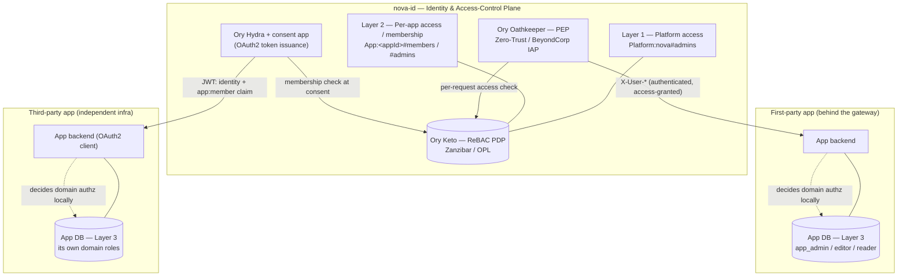

# ADR-0003: Three-layer authorization model — platform & per-app access in Keto, per-app domain roles in each app's DB

- **Status:** Accepted
- **Date:** 2026-06-14
- **Deciders:** Carlos (owner), architecture review
- **Context phase:** A0 (security & foundations); refined by A1 (BFF consolidation)
- **Relates to:** [ADR-0001](0001-idp-vs-demo-app-boundary.md), [ADR-0002](0002-idp-does-not-mint-approle.md)

> This ADR formalizes a decision that already exists inline in `../PLAN_BUCKET_A.md:12-15`
> ("Decided model … 3 layers") and `../AUDIT_FINDINGS.md` ("Roles model"). It does not introduce a
> new decision; it makes the existing one immutable, citable, and anchored to the codebase and to
> the official Ory v25.4.0 model. ADR-0001 and ADR-0002 already depend on this layering; this record
> is its canonical source.

## Context

Nova ID is a multi-tenant identity platform: registered apps are tenants that share one Kratos
identity pool, and the IdP centralizes both identity (authn) and per-app *access* authorization. It
is deliberately **not** thin-authn-only and **not** a total centralized-authz plane — it is the
*access-control plane* (`../AUDIT_FINDINGS.md:61-66`).

Before this decision the role concept was fragmented across three stores with a half-finished
migration (`../AUDIT_FINDINGS.md:38-43`):

- `traits.role` in Kratos (user-editable — was a privilege-escalation path),
- `ranks`/`roles` relation tuples in Keto (legacy `ranks`, intended `roles`), and
- a flat `app_role` table in the IdP's internal SQLite module.

Two forces pull the role model in opposite directions:

1. **App admins must run Kratos identity operations** (add/remove/edit/recovery) on *their* app's
   users, and Kratos lives inside the IdP — so the IdP must know who administers each app. That
   argues for app *access*/membership being centralized in the IdP, not buried in each app's DB
   (`../AUDIT_FINDINGS.md:63`).
2. **Each app has its own internal domain model** (editor/reader/viewer, finer permissions) that
   the IdP has no business knowing — embedding it in the IdP would force the IdP's token schema and
   policy graph to grow with every consuming app (`../AUDIT_FINDINGS.md:79`, ADR-0002).

The established industry pattern reconciles these by *layering*: coarse-grained access decided
centrally, fine-grained domain permissions decided locally by each service. A hybrid model —
coarse control at a higher level, fine-grained control inside the resource owner — is the common,
recommended shape, giving "central control and decentralized execution" ([WorkOS]; [Ory:authz-svc]).
Ory's own stack is built for exactly this split: Oathkeeper is the central Policy Enforcement Point
("a reverse proxy in front of your upstream API … that rejects unauthorized requests and forwards
authorized ones") implementing Zero-Trust / BeyondCorp / IAP ([Ory:oathkeeper]); Keto is the
relationship-based Policy Decision Point implementing the Google Zanzibar model ([Ory:opl];
[Zanzibar]).

## Decision

Adopt a **three-layer authorization model**. The boundary between the layers is intentional and the
layers are **NOT merged**.

| Layer | Lives in | Decides | Enforced by |
|---|---|---|---|
| **1. Platform** | **Keto** (nova-id) | who administers the IdP itself (`platform_admin`, `manage_users`) | Oathkeeper + IdP guards |
| **2. Per-app ACCESS / membership** | **Keto** (nova-id) | may X reach/consume app *A*? may X administer app *A*'s users? | Oathkeeper (per-request Keto check) / consent app (at token issuance) |
| **3. Per-app DOMAIN roles** | **each app's own DB** | what may X do *inside* app *A* (editor/reader, fine-grained permissions) | the app itself |

The dividing line in one sentence: **Keto answers "may you reach/enter X"; the app's own DB answers
"what may you do once inside X."**

Concretely:

- Layers 1 and 2 are **ReBAC relationship tuples in Ory Keto**, the single source of truth for
  *access*. The OPL schema declares three namespaces (`config/keto/namespaces.keto.ts`):
  - `Platform:nova#admins@user:<id>` ⇒ platform admin; `permits.administer` / `permits.manage_users`
    are true only for platform admins (`config/keto/namespaces.keto.ts:8-22`).
  - `App:<appId>#members@user:<id>` ⇒ may consume the app; `App:<appId>#admins@user:<id>` ⇒ admin
    of that app. Admins are members too (`admins ⊆ members`) via a subject-set rewrite
    (`config/keto/namespaces.keto.ts:35-54`).
  - Platform admin is deliberately **not** an implicit App admin — that is a separate per-app tuple
    written through the Platform-gated keto-write path (`config/keto/namespaces.keto.ts:26-34`).
- Layer 3 (an app's internal `app_admin`/`app_user` and finer permissions) lives in **each app's
  own database**, owned by that app. nova-id never stores, mints, or reasons about per-app domain
  roles; the app maps the verified identity (plus the membership claim carried in the token) to its
  own roles (`../AUDIT_FINDINGS.md:79`, ADR-0002).
- Consequences for the fragmented stores: `traits.role` becomes non-authoritative (mark
  `ory:protected`, admin-managed, denormalized convenience only); the `ranks`→`roles` migration is
  finished and the legacy YAML namespaces are replaced by the OPL schema above; the IdP's internal
  flat `app_role` SQLite module is superseded by Keto per-app relations for *platform-visible*
  access — the demo app retains its **own** SQLite roles as an example of a Layer-3 store
  (ADR-0001, ADR-0002).

### Layer diagram

Two runtime modes consume the same Layer-2 source of truth (`../AUDIT_FINDINGS.md:90-100`):

- **First-party** apps run behind Oathkeeper; the gateway does the Keto access check **per request**
  and injects `X-User-*`. This is the BeyondCorp / IAP pattern Oathkeeper is built for
  ([Ory:oathkeeper]).
- **Third-party** apps register as Hydra OAuth2 clients; the consent app does the Keto membership
  check **at token-issuance time** and accepts (emit token + `app:member` claim) or rejects. Hydra
  has no native Keto hook, so the consent app is the enforcement point — fixing it is A1 work.

## Alternatives considered

- **All-in-Keto (push Layer 3 into Keto too).** Rejected. OPL/Keto can technically express
  fine-grained, per-resource permissions ([Ory:opl]), so this is feasible — but it forces the
  central IdP to model every consuming app's internal domain (editor/reader/per-object rules),
  growing the central policy graph and token schema with each app and re-introducing exactly the
  layering violation ADR-0002 removes. It also concentrates all authorization in one blast radius
  and adds per-request central latency for decisions an app could make locally. The recommended
  shape is the hybrid split — coarse central, fine local — not centralizing everything ([WorkOS]).

- **All-in-app-DB (push Layers 1 & 2 into each app's database).** Rejected. App admins must perform
  Kratos identity operations that physically live in the IdP, so the IdP must know who may
  administer each app's users; if access/membership lived only in each app's DB the IdP could not
  gate those operations (`../AUDIT_FINDINGS.md:63`). It also loses a single, auditable source of
  truth for "who can reach which app," duplicates membership logic per app, and discards the
  central PEP/PDP (Oathkeeper + Keto) that Ory provides for precisely this ([Ory:oathkeeper]).

- **Single store via Kratos `traits.role`.** Rejected. A user-editable identity trait is not an
  authorization source — it was a direct privilege-escalation path (`../AUDIT_FINDINGS.md:13`,
  Path 2) and cannot model per-app, relationship-scoped access. It is demoted to a non-authoritative
  denormalized convenience.

- **Keep the legacy YAML `ranks` namespaces (no OPL).** Rejected. Legacy mode has no schema
  enforcement and no computed/inherited permissions (`../AUDIT_FINDINGS.md:43`); the OPL schema
  gives type-checked namespaces and subject-set rewrites (admin ⊆ member) ([Ory:opl]).

## Consequences

### Positive

- One auditable source of truth for *access* (Keto), and clean separation from app-internal domain
  logic — the IdP token schema is app-agnostic and stable as new apps onboard (ADR-0002).
- Uses Ory's native, intended tools for each role: Oathkeeper as PEP, Keto as Zanzibar-style PDP
  ([Ory:oathkeeper], [Ory:opl], [Zanzibar]).
- Both consumption modes (gateway per-request, consent at issuance) read the same Layer-2 truth, so
  access decisions are consistent regardless of how an app integrates.
- Matches the widely recommended hybrid pattern: central control, decentralized execution
  ([WorkOS], [Ory:authz-svc]).

### Negative

- **Two-system writes on app lifecycle.** Onboarding an app writes both a Hydra OAuth2 client and
  Keto `App:<appId>` tuples; this needs an idempotent, reconcilable operation, and offboarding must
  revoke the client *and* delete the tuples (`../AUDIT_FINDINGS.md:106`).
- **Stale-permission window.** Keto exposes no Zanzibar zookie/ZedToken consistency token, so a
  revocation can lag a cached decision; mitigate with short cache TTL + event-driven invalidation
  on access change (`../AUDIT_FINDINGS.md:104`, cf. [Zanzibar] external consistency).
- **Central dependency / SPOF + latency.** Gateway or Keto unavailability affects all first-party
  apps, and each request pays a central check. This is the accepted cost of a central access plane
  (`../AUDIT_FINDINGS.md:111`).
- **Must run fail-closed before reliance.** If Keto is unreachable or the tuple is absent → DENY.
  This requires Keto on Postgres + seed-on-boot (the A0 work) before flipping off the legacy
  fail-open behavior (`../AUDIT_FINDINGS.md:103`).

### Neutral

- The demo app keeps its own SQLite roles as a deliberate Layer-3 example (ADR-0001) — it is not a
  violation of this ADR, it *is* the model.
- Optional future complements (Cerbos as a per-app fine-grained sidecar, SCIM 2.0 for provisioning)
  fit cleanly as Layer-3 / provisioning concerns and are out of scope here
  (`../AUDIT_FINDINGS.md:109`).

## Trade-offs

Centralizing *access* (Layers 1–2) accepts a central dependency and a stale-permission window in
exchange for one auditable, app-agnostic source of truth for who-may-reach-what. Keeping *domain*
authorization (Layer 3) in each app accepts that nova-id cannot reason about in-app permissions in
exchange for a stable token schema and zero coupling between the IdP and each app's internal model.
Coarse-central / fine-local is chosen over both all-in-Keto and all-in-app-DB.

## Sources

- [Ory:opl] Ory Permission Language specification — "The Ory Permission Language is a syntactical
  subset of TypeScript"; namespaces/relations/permissions; checks translate to Zanzibar concepts.
  https://www.ory.com/docs/keto/reference/ory-permission-language
- [Ory:keto-tuples] Ory Keto — Relation Tuples (the ReBAC datatype `object#relation@subject`).
  https://www.ory.com/keto/docs/concepts/relation-tuples/
- [Ory:oathkeeper] Ory Oathkeeper — "It can be the Policy Enforcement Point … a reverse proxy in
  front of your upstream API … that rejects unauthorized requests"; "Zero-Trust Network
  Architecture, BeyondCorp, and Identity And Access Proxy (IAP)"; can act as PDP for other gateways.
  https://www.ory.com/docs/oathkeeper
- [Zanzibar] Pang et al., "Zanzibar: Google's Consistent, Global Authorization System," USENIX ATC
  2019 — the ReBAC model Keto implements; external consistency, uniform data model for ACLs.
  https://www.usenix.org/conference/atc19/presentation/pang (PDF:
  https://www.usenix.org/system/files/atc19-pang.pdf)
- [WorkOS] WorkOS, "Coarse-grained vs. fine-grained access control: which should you use?" — hybrid
  model: coarse control at a higher level, fine-grained control for sensitive operations.
  https://workos.com/blog/coarse-grained-vs-fine-grained
- [Ory:authz-svc] Ory blog, "What is the Ory Permission Language" — centralized, Git/API/GUI-managed
  policy enforced locally where services live ("central control and decentralized execution").
  https://www.ory.com/blog/what-is-the-ory-permission-language

## Repository references

- `config/keto/namespaces.keto.ts:8-22` — `Platform:nova` namespace (Layer 1).
- `config/keto/namespaces.keto.ts:35-54` — `App:<appId>` namespace, `members`/`admins`, `admin ⊆ member` (Layer 2).
- `config/keto/namespaces.keto.ts:26-34` — platform admin is not an implicit app admin (design note).
- `../PLAN_BUCKET_A.md:12-15` — inline "Decided model … 3 layers" this ADR formalizes.
- `../AUDIT_FINDINGS.md:61-111` — "Roles model (DECIDED)", three layers, two runtime modes, operational requirements.
- [ADR-0001](0001-idp-vs-demo-app-boundary.md), [ADR-0002](0002-idp-does-not-mint-approle.md) — where the Layer-2/Layer-3 boundary sits in code.
