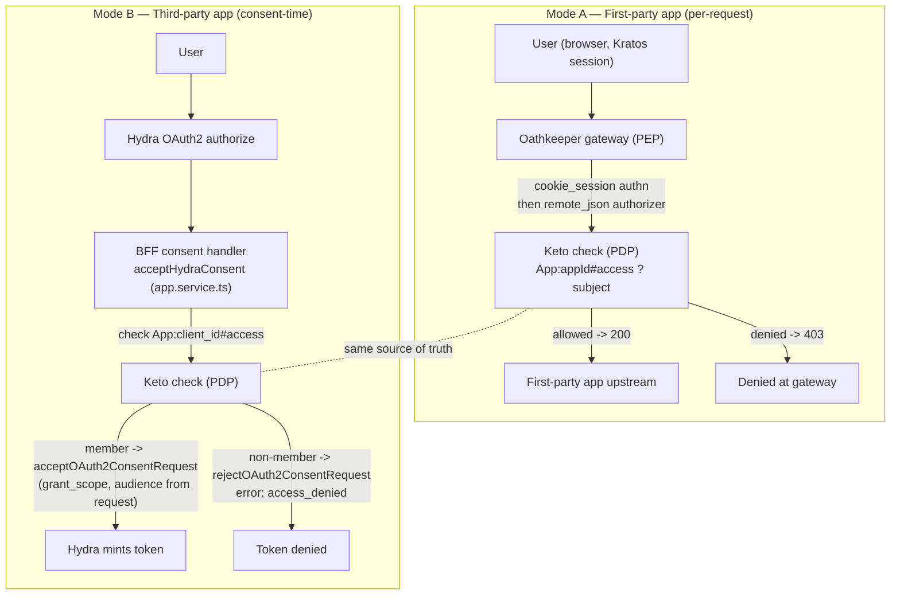

# ADR-0004: Enforce per-app access in two coexisting modes, with Keto as the single source of truth

- **Status:** Accepted
- **Date:** 2026-06-14
- **Deciders:** Carlos (owner), architecture review
- **Context phase:** A1 (BFF consolidation), forced by A1-plan-2 (OAuth + access gates), covering
  roadmap items A1.4 (consent gate) and A1.5 (gateway gate)
- **Relates to:** [ADR-0001](0001-idp-vs-demo-app-boundary.md), [ADR-0002](0002-idp-does-not-mint-approle.md), [ADR-0003](0003-three-layer-authorization-model.md)

## Context

Nova ID is a self-hosted identity + access-control plane built on Ory v25.4.0
(Kratos / Hydra / Keto / Oathkeeper). The decided model is three layers: **platform & per-app
*access* live in Keto (ReBAC); per-app *domain* roles live in each app's own DB**
([ADR-0003](0003-three-layer-authorization-model.md); refined by ADR-0001/0002). This ADR
formalises **how per-app access is enforced**, a decision that until now lived only as an inline
roadmap note
(`../PLAN_BUCKET_A.md:12-15` and the A1.4 / A1.5 tasks at `../PLAN_BUCKET_A.md:105-113`).

The forces at play:

1. **Two consumption shapes coexist.** Nova ID serves *first-party* apps (apps we own, sitting
   behind our own Oathkeeper gateway, sharing the Kratos session cookie) **and** *third-party*
   apps (independent clients that integrate via the OAuth2/OIDC authorization-code flow and never
   sit behind our gateway). The OAuth 2.0 Security BCP (RFC 9700) treats these as distinct trust
   classes; a single enforcement point cannot cover both, because a third-party client's traffic
   to *its own* backend never transits our PEP.

2. **Authorization must be a per-request, dynamically-evaluated decision.** Zero Trust
   (NIST SP 800-207) requires that "all access decisions enforced at the PEP … be bounded in time
   (per-session or even per-request) and … be rendered dynamically." Encoding access *only* into a
   long-lived token at issuance time violates this: a revoked membership would still satisfy a
   token that is valid for an hour.

3. **There must be one source of truth for "may this subject use this app."** Splitting that fact
   between a token claim and a Keto tuple reintroduces exactly the dual-source ambiguity ADR-0002
   eliminated for `appRole`. Access is an infra-layer concept and belongs in Keto.

4. **The gateway and the consent step are the two natural enforcement points** already present in
   the stack. Oathkeeper is documented as a reverse proxy / identity-and-access proxy that
   "reaches decisions to allow or deny access by applying Access Rules"; its `remote_json`
   authorizer already calls Keto today (`config/oathkeeper/rules.local.json`, rule `kratos-admin`,
   lines 99-106; `config/oathkeeper/oathkeeper.local.yml:108-114`). Hydra's consent app is the
   documented place to `accept` or `reject` an authorization with an OAuth `error` such as
   `access_denied`.

## Decision

**Per-app access is enforced in two coexisting modes, and Keto is the source of truth for access
in both.** The canonical access fact is the Keto relation **`App:<appId>#access`** for the
authenticated subject, where the `App` object id **is the Hydra `client_id`** of that app.

### Mode A — First-party apps: per-request check at the Oathkeeper gateway (PEP)

First-party app routes get a dedicated Oathkeeper access rule whose **`remote_json` authorizer
calls Keto's check endpoint** for `App:<appId>#access` on the authenticated subject, on **every
request**. Keto is the Policy Decision Point (PDP); Oathkeeper is the Policy Enforcement Point
(PEP). Oathkeeper authenticates the subject (`cookie_session`), the authorizer asks Keto, and the
request is forwarded only if Keto returns the allowed result; otherwise it is denied at the
gateway before reaching any upstream. This is the pattern already proven by the `kratos-admin` /
`hydra-admin` / `frontend-admin` rules — extended from platform-admin checks to per-app `#access`
checks (the A1.5 task, `../PLAN_BUCKET_A.md:110-113`).

### Mode B — Third-party apps: check at the Hydra consent step (consent-time PDP call)

Third-party apps integrate via the OAuth2/OIDC authorization-code flow and never traverse our
gateway, so there is no per-request PEP we control. The BFF therefore enforces access **at the
Hydra consent step**: in `acceptHydraConsent` (`api/src/app.service.ts:203-227`) the BFF first
**checks Keto `App:<client_id>#access`** for the authenticated subject. If the subject is a
member, the BFF accepts the consent (embedding the membership/role claims, with
`grant_access_token_audience` taken from the consent request — not from browser input). If the
subject is **not** a member, the BFF **rejects the consent request with the OAuth error
`access_denied`**, so Hydra never mints a token for a non-member.

### Invariant across both modes

The two modes are two enforcement *points* over the **same** PDP fact. A subject's right to use an
app is added/removed by writing/deleting one Keto tuple (`App:<appId>#access`), and both the
gateway check (Mode A) and the consent check (Mode B) observe that change immediately. No token
claim is ever the source of truth for access; per ADR-0002 the IdP does not mint app-domain roles,
and per this ADR it does not treat any minted access claim as authoritative — it is at most a
cached convenience derived from the Keto fact at issuance.

## Alternatives considered

- **Enforce only at token-issuance time (bake `App#access` into the token, no per-request check).**
  Rejected. It violates the NIST SP 800-207 tenet that access be re-evaluated per-session/per-request
  and dynamically: a membership revoked mid-session would still be honoured until the token expired.
  It also recreates the dual-source ambiguity ADR-0002 removed — the token, not Keto, would become a
  competing source of truth for access. RFC 9700 further pushes access-token privileges toward the
  minimum required and re-checkable, not a static long-lived grant.

- **Enforce only at the gateway (Oathkeeper PEP for everything).** Rejected because it is
  *structurally impossible* for third-party apps: their traffic flows to their own backends and to
  Hydra's token endpoints, never through our Oathkeeper. A gateway-only model would leave
  third-party access ungated, since we cannot put a PEP in front of a client we do not host. The
  consent step is the only point we control in that flow.

- **A standalone PDP sidecar per app (e.g. Cerbos) instead of Keto.** Rejected for this bucket
  (explicitly out of scope, `../PLAN_BUCKET_A.md:154-156`). It adds a second authorization system
  alongside Keto and contradicts the "Keto is the source of truth for access" invariant. Kept as a
  possible future complement for app-*domain* policy, not for the platform access fact.

- **Keep the public `keto-write` browser route and let apps self-assert membership.** Rejected
  (and being closed in A0.3). Browsers must not write access tuples; membership is granted through a
  guarded BFF path. This ADR assumes that hardening is in place.

## Consequences

### Positive

- **One source of truth.** Access is exactly one Keto tuple (`App:<appId>#access`); grant/revoke is
  a single write that both enforcement points observe immediately. No token re-issuance needed to
  revoke access in Mode A.
- **Zero-Trust-aligned for first-party traffic.** Mode A is a genuine per-request PEP→PDP check at
  the gateway, matching NIST SP 800-207's per-session/per-request, dynamically-evaluated tenet.
- **Correct OAuth semantics for third-party traffic.** Non-members are denied with the standard
  `access_denied` error at consent, so Hydra never issues a token to a non-member — cleaner than
  issuing a token and rejecting it downstream.
- **App-agnostic IdP token schema preserved.** Consistent with ADR-0002, the IdP still does not mint
  app-domain roles; the access fact lives in Keto, keyed by `client_id`, so onboarding a new app is a
  tuple write plus (for first-party) one Oathkeeper rule — no token-schema change.
- **Uniform mental model.** Both modes are "ask Keto `App:<appId>#access`"; only the enforcement
  *point* differs.

### Negative

- **Two enforcement points to keep correct.** A change to the access semantics must be reflected in
  both the Oathkeeper rule (Mode A) and the BFF consent handler (Mode B). Mitigation: both call the
  identical Keto relation, so the *policy* is single-sourced even though the *call sites* are two.
- **Per-request Keto latency in Mode A.** Each first-party request incurs a Keto check round-trip.
  Acceptable at current scale; Keto's check endpoint is built for low-latency permission checks and
  can be tuned (e.g. max search depth). Revisit with caching only if measured latency demands it.
- **Mode B re-checks only at consent, not per-request.** Once a third-party token is minted it is
  valid for its lifetime; a membership revoked after consent is enforced on the *next* consent, not
  mid-token. This is inherent to OAuth third-party integration (we do not own their PEP). Mitigation:
  short token lifetimes and, where the resource server is ours, an introspection/`#access` re-check.

### Neutral

- **Fail-closed is mandatory and load-bearing.** Because Keto is the sole authority, the access
  layer is fail-closed (A0.7): if Keto is unreachable *or the tuple is absent*, access is **denied**.
  The direct corollary: **`App:<appId>#access` tuples MUST be provisioned (seed-on-boot / admin
  grant) or every subject is denied every app.** An empty Keto = a locked-down platform, by design.
  Provisioning the seed tuples is a deployment prerequisite, not an optional step.
- The `App` object id being the Hydra `client_id` couples the two namespaces by convention; this is
  intentional so that Mode A and Mode B key off the same identifier.

## Trade-offs

Correctness and a single source of truth for access are prioritised over the convenience of a
single static token grant. We accept two enforcement *points* (gateway + consent) as the cost of
covering both first-party and third-party consumption, and we accept per-request Keto latency in
Mode A as the cost of Zero-Trust-aligned, immediately-revocable access. Fail-closed is accepted as
the safe default, with mandatory tuple provisioning as its explicit operational obligation.

## Sources

Decision-grounding repo references (verified in-tree):

- `../PLAN_BUCKET_A.md:12-15` — "Two runtime modes coexist … Keto is the source of truth for
  access in both."
- `../PLAN_BUCKET_A.md:105-113` — A1.4 (consent-time Keto gate, `reject` with `access_denied`) and
  A1.5 (first-party per-request Keto check for `App:<appId>` at the gateway).
- `config/oathkeeper/rules.local.json:99-106`, `:209-216` — existing `remote_json` → Keto
  `relation-tuples/check` authorizers (pattern extended to per-app `#access`).
- `config/oathkeeper/oathkeeper.local.yml:108-114` — `remote_json` authorizer wired to
  `http://keto:4466/relation-tuples/check` (Keto read API, port 4466).
- `api/src/app.service.ts:203-227` — `acceptHydraConsent`, the consent-accept handler where the
  Mode-B Keto membership gate is added.
- ADR-0001 (`0001-idp-vs-demo-app-boundary.md`), ADR-0002 (`0002-idp-does-not-mint-approle.md`),
  ADR-0003 (`0003-three-layer-authorization-model.md`).

External authoritative sources (fetched and verified):

- Ory Oathkeeper — Access Rules: <https://www.ory.com/docs/oathkeeper/api-access-rules> ("Ory
  Oathkeeper reaches decisions to allow or deny access by applying Access Rules"; rule structure
  match/authenticators/authorizer/mutators/upstream; identity-and-access proxy at the gateway).
- Ory Oathkeeper — Authorizers (`remote_json`):
  <https://www.ory.com/docs/oathkeeper/pipeline/authz> ("If the endpoint returns a '200 OK'
  response code, the access is allowed, if it returns a '403 Forbidden' response code, the access is
  denied"; payload templating with `{{ print .Subject }}`).
- Ory Hydra — Login & Consent flow:
  <https://www.ory.com/docs/hydra/guides/consent> (`rejectOAuth2ConsentRequest` with
  `error: 'access_denied'`; `grant_access_token_audience` echoed from the consent request, not
  browser input; `acceptOAuth2ConsentRequest` for members).
- Ory Keto — Permission check API:
  <https://www.ory.com/docs/keto/concepts/api-overview> ("The Check API allows you to check whether
  a subject has a relation on an object"; returns an `allowed` boolean).
- NIST SP 800-207, *Zero Trust Architecture* (Rose, Borchert, Mitchell, Connelly; Aug 2020):
  <https://csrc.nist.gov/pubs/sp/800/207/final> ("Zero trust assumes there is no implicit trust
  granted to assets or user accounts based solely on their physical or network location"; access
  decisions at the PEP bounded per-session/per-request and rendered dynamically; PEP enforces the
  decision rendered by the PDP).
- RFC 9700, *Best Current Practice for OAuth 2.0 Security*:
  <https://datatracker.ietf.org/doc/rfc9700/> (first-party vs third-party client trust classes;
  access-token privileges restricted to the minimum required; PKCE for confidential clients).
