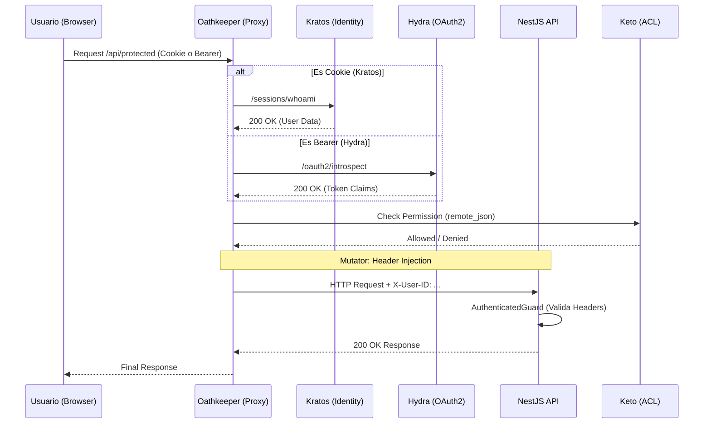

# Security and Architecture Analysis Report: Nova ID

## 🔍 Resumen Ejecutivo

### Estado General de Seguridad: 7/10
El proyecto presenta una arquitectura robusta basada en **Ory Stack**, siguiendo principios de **Zero Trust** mediante el uso de **Ory Oathkeeper** como Identity & Access Proxy. La separación de responsabilidades entre gestión de identidad (Kratos), autorización (Hydra), control de acceso (Keto) y el proxy de acceso es excelente y sigue las mejores prácticas de la industria.

Sin embargo, se han detectado debilidades en la implementación técnica local que podrían comprometer la seguridad si se trasladan a producción sin cambios.

### Vulnerabilidades Críticas Encontradas
1.  **Clave Pública JWT Hardcodeada en API:** El `AuthenticatedGuard` utiliza una clave pública por defecto si no se proporciona una por variable de entorno. Aunque es para desarrollo, el patrón de tener un "fallback" inseguro es peligroso.
2.  **Configuración de CORS Excesivamente Permisiva:** La API tiene `origin: true`, lo que permite cualquier origen, y expone cabeceras sensibles de identidad.
3.  **Almacenamiento de Tokens en Frontend:** Los tokens de acceso se almacenan en `sessionStorage`, lo que los hace vulnerables a ataques XSS.

### Recomendaciones Prioritarias
1.  **Eliminar fallbacks de seguridad:** Asegurar que la API falle si faltan las claves criptográficas o configuraciones de emisor de JWT.
2.  **Restringir CORS:** Implementar una lista blanca estricta de dominios permitidos tanto en Oathkeeper como en la API de NestJS.
3.  **Implementar Rate Limiting:** Añadir protección contra fuerza bruta y DoS a nivel de API y Oathkeeper.
4.  **Rotación de Secretos:** Mover todos los secretos hardcodeados en archivos YAML a un gestor de secretos o variables de entorno seguras.

---

## 🏗️ Arquitectura Actual

### Stack Tecnológico
-   **Identity Management:** Ory Kratos
-   **OAuth2 & OIDC Provider:** Ory Hydra
-   **Global Permissions (Zanzibar):** Ory Keto
-   **Identity & Access Proxy:** Ory Oathkeeper (Zero Trust Gatekeeper)
-   **Backend:** NestJS (TypeScript) con TypeORM
-   **Frontend:** Vue.js (Vite)

### Flujos de Autenticación Implementados
1.  **Authorization Code Flow con PKCE:** Utilizado por las aplicaciones cliente para obtener tokens de Hydra de forma segura.
2.  **Session Management:** Gestionado por Kratos mediante cookies de sesión (`ory_kratos_session`).
3.  **Token Introspection:** Oathkeeper valida los tokens de Hydra contra el endpoint de introspección de Hydra.
4.  **Zero Trust Header Injection:** Oathkeeper valida la identidad y añade cabeceras `X-User-ID`, `X-User-Email`, etc., antes de reenviar la petición a la API.

### Diagrama de Flujo (Lógica de Acceso)


---

## 🚨 Vulnerabilidades Detectadas

### 1. Cryptographic Weakness: Hardcoded JWT Public Key
-   **Severidad:** ALTA
-   **Ubicación:** [api/src/guards/authenticated.guard.ts:14-22](file:///home/cativo23/projects/personal/nova-id/api/src/guards/authenticated.guard.ts#L14-22)
-   **Descripción:** Se incluye una clave pública `DEFAULT_PUBLIC_KEY` por defecto. Si un despliegue olvida configurar `OAUTH_PUBLIC_KEY`, la API aceptará cualquier JWT firmado con la clave privada correspondiente a ese par hardcodeado.
-   **Impacto:** Suplantación de identidad total si la clave privada es conocida o si el atacante puede firmar sus propios tokens.
-   **Remediación:**
```typescript
// En AuthenticatedGuard.ts
private getJwtPublicKey(): string {
  const key = this.config.get<string>('OAUTH_PUBLIC_KEY');
  if (!key && this.config.get('NODE_ENV') === 'production') {
    throw new Error('OAUTH_PUBLIC_KEY must be defined in production');
  }
  return key || DEFAULT_PUBLIC_KEY;
}
```

### 2. Broken Access Control: Permissive CORS Configuration
-   **Severidad:** MEDIA
-   **Ubicación:** [api/src/main.ts:12-17](file:///home/cativo23/projects/personal/nova-id/api/src/main.ts#L12-17)
-   **Descripción:** `origin: true` refleja cualquier cabecera `Origin` recibida. Además, permite explícitamente las cabeceras `X-User-ID` y `X-User-Email`.
-   **Impacto:** Facilita ataques de Cross-Site Request Forgery (CSRF) y permite que sitios maliciosos interactúen con la API si esta llega a ser expuesta fuera de Oathkeeper.
-   **Remediación:**
```typescript
app.enableCors({
    origin: process.env.ALLOWED_ORIGINS?.split(',') || ['http://localhost:3000'],
    credentials: true,
    methods: ['GET', 'POST', 'PUT', 'DELETE', 'PATCH', 'OPTIONS'],
    allowedHeaders: ['Content-Type', 'Authorization', 'X-Frontend-Source'], // NO permitir X-User-ID desde el cliente
});
```

### 3. Sensitive Data Exposure: Tokens en SessionStorage
-   **Severidad:** MEDIA
-   **Ubicación:** [frontend-app/src/composables/useHydraOAuth.js:168](file:///home/cativo23/projects/personal/nova-id/frontend-app/src/composables/useHydraOAuth.js#L168)
-   **Descripción:** El `access_token` y el `id_token` se guardan en `sessionStorage`.
-   **Impacto:** Un ataque XSS exitoso puede robar estos tokens y usarlos para suplantar al usuario hasta que expiren.
-   **Remediación:** Utilizar cookies con atributos `HttpOnly`, `Secure` y `SameSite=Lax`. Alternativamente, mantener los tokens solo en memoria y usar `Silent Refresh`.

### 4. Lack of Rate Limiting
-   **Severidad:** BAJA-MEDIA
-   **Ubicación:** [api/src/app.module.ts](file:///home/cativo23/projects/personal/nova-id/api/src/app.module.ts)
-   **Descripción:** No se observa el uso de `ThrottlerModule` o similar para limitar el número de peticiones por IP o Usuario.
-   **Impacto:** Vulnerabilidad a ataques de Denegación de Servicio (DoS) y fuerza bruta en endpoints sensibles.
-   **Remediación:** Implementar `ThrottlerModule` en NestJS y configurar rate limiting en Oathkeeper.

---

## ✅ Puntos Fuertes
-   **Arquitectura Zero Trust Real:** La API no gestiona sesiones directamente, confía en el IAP (Oathkeeper), lo que simplifica la seguridad del backend y centraliza la política.
-   **Implementación Correcta de PKCE:** El flujo de OAuth2 en el frontend utiliza correctamente `code_verifier` y `code_challenge` con SHA-256.
-   **Uso de Keto para Autorización:** Las reglas de acceso en Oathkeeper consultan a Keto (`remote_json`), permitiendo un control de acceso granular y centralizado.
-   **Segmentación de Red:** El uso de redes Docker separadas (`ory-internal` vs `apps`) es una excelente práctica de seguridad de infraestructura.

---

## 🎯 Recomendaciones de Mejora

### 1. Críticas (Inmediatas)
-   **Validación Estricta de JWT:** Asegurar que el `issuer` y la `audience` se validen siempre.
-   **Cierre de Circuitos de Confianza:** La API debe validar que las peticiones vienen *realmente* de Oathkeeper (por ejemplo, mediante un secreto compartido en una cabecera o mTLS si la red no es de confianza).

### 2. Quick Wins (Bajo Esfuerzo)
-   **Actualizar cabeceras de seguridad:** Añadir `Content-Security-Policy`, `X-Content-Type-Options` y `Strict-Transport-Security` en Oathkeeper o un Nginx frontal.
-   **Sanitización de Logs:** Aunque se usa un interceptor de logging, asegurar que nunca se registren tokens o datos sensibles de identidad en texto claro (verificar `leak_sensitive_values: true` en Kratos, cambiar a `false` en prod).

---

## 📋 Checklist de Seguridad OAuth2/OIDC
- [x] PKCE implementado correctamente (usando SHA-256)
- [x] State parameter validado en el callback
- [ ] Tokens almacenados de forma segura (actualmente en sessionStorage)
- [x] Refresh token rotation habilitado (Hydra lo soporta por defecto)
- [x] Scopes apropiados definidos (`openid`, `profile`, `email`)
- [x] Redirect URIs validadas (vía configuración de cliente en Hydra)
- [x] Token expiration apropiado (access: 1h, refresh: 30d)
- [ ] HTTPS forzado (configurado para localhost currently)
- [x] Logout implementado correctamente (vía Kratos y Hydra)
- [ ] CORS configurado restrictivamente (actualmente permisivo)
- [ ] Headers de seguridad presentes (Faltan CSP, HSTS)

---

## 🔧 Código de Ejemplo para Correcciones

### Implementación Segura de CORS y Rate Limiting (NestJS)
```typescript
// main.ts
import { NestFactory } from '@nestjs/core';
import { AppModule } from './app.module';
import helmet from 'helmet';

async function bootstrap() {
  const app = await NestFactory.create(AppModule);
  
  // Seguridad de Headers
  app.use(helmet());
  
  // CORS Restrictivo
  app.enableCors({
    origin: process.env.ALLOWED_ORIGINS?.split(',') || ['http://localhost:3000'],
    credentials: true,
  });
  
  await app.listen(3000);
}
```

### Middleware de Validación de Origen Oathkeeper (API Guard)
```typescript
// authenticated.guard.ts (Mejora)
async canActivate(context: ExecutionContext): Promise<boolean> {
  const request = context.switchToHttp().getRequest();
  
  // Validar Secreto de Confianza (Opcional pero recomendado en redes compartidas)
  const okSecret = request.headers['x-oathkeeper-secret'];
  if (process.env.NODE_ENV === 'production' && okSecret !== process.env.OATHKEEPER_SHARED_SECRET) {
     throw new UnauthorizedException('Request must come from Oathkeeper');
  }
  
  // ... resto de la lógica actual ...
}
```
